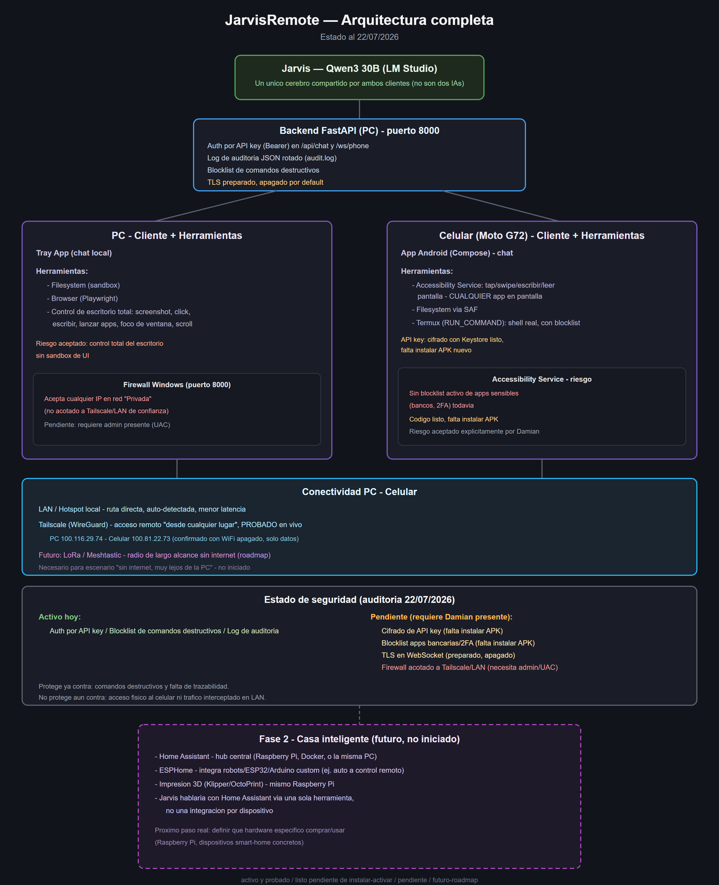

# JarvisRemote

Herramienta de **auditoría de código / pentesting** que corre con un LLM
**local** (vía [Ollama](https://ollama.com), sin mandar tu código a ningún
servicio en la nube). Le apuntás a la carpeta de cualquier proyecto y arma
una estructura tipo grafo de todo el código -- pensada para que la IA (o tu
equipo) pueda navegarlo y **encontrar vulnerabilidades antes de lanzar algo
al mercado**.

> 🚧 **En desarrollo activo.** Todavía falta pulir bastante -- lo comparto
> como está, no como algo terminado.

## Qué hace

- **Indexa cualquier codebase**: le apuntás a una carpeta y detecta
  automáticamente los lenguajes (vía
  [tree-sitter](https://tree-sitter.github.io/tree-sitter/), con fallback
  genérico para lo que no tiene grammar propia) para construir un **grafo**
  del proyecto -- archivos, funciones, clases, y los imports resueltos como
  edges entre archivos. Pestaña "Codebase" en la ventana de PC, árbol
  coloreado por lenguaje.
- **Vault de notas estilo Obsidian, con la misma lógica de grafo**: podés
  dejarle a la IA instrucciones y contexto útil sobre el proyecto -- o, si
  trabajás en equipo, notas para tus compañeros -- en Markdown real
  (frontmatter YAML, abribles con Obsidian de verdad), enlazadas entre sí por
  wikilinks (`[[nota]]`) igual que en el grafo de código. Pestaña "Obsidian"
  en la ventana de PC, con autoría separada entre lo que escribe Jarvis y lo
  que escribís vos.
- **El objetivo**: darle a la IA (o a un auditor humano) el mapa completo del
  proyecto -- estructura + contexto -- para poder revisar el código en busca
  de vulnerabilidades antes de shippear, en vez de auditar a ciegas archivo
  por archivo.

### Sobre el modelo local

Corre 100% en tu PC, no manda código a ningún servicio externo. Ahora mismo
lo estoy usando con un modelo de **~30B de parámetros** -- es lo más grande
que puedo correr localmente sin destruir la PC. Es una limitación real
por ahora, no una elección de diseño: modelos más grandes deberían dar
mejores resultados de auditoría, pero por ahora esto es lo que corre local y
sin destruir el hardware.

Hay funcionalidad adicional en desarrollo (más allá de indexar código y
tomar notas) -- ver el [informe completo](INFORME_COMPLETO.md) si te interesa
el detalle.

## Arquitectura



- **`backend/`** — Python + FastAPI. Habla con Ollama (API compatible con
  OpenAI) y corre el loop del agente. Ahí viven el indexer de codebases
  (`app/codebase/`, vía tree-sitter) y el vault de notas estilo Obsidian
  (`app/obsidian/`).
- **`tray-app/`** — Python + pystray. Administra el backend como subproceso
  y tiene la ventana con las pestañas Codebase y Obsidian.
- **`android-app/`** — componente aparte, en desarrollo, no hace falta para
  usar la herramienta de auditoría de código. Ver
  [informe completo](INFORME_COMPLETO.md) si te interesa.

## Instalación

### Con un comando (backend + tray-app)

```powershell
.\install.ps1
```

Detecta tu hardware, instala/verifica Ollama, baja y arma el modelo de texto
del tier que corresponda, y deja `backend/.env` + los venvs de `backend/` y
`tray-app/` listos. Es idempotente: correrlo de nuevo no reinstala ni pisa lo
que ya tenías.

### Manual, paso a paso

```bash
# 1. Backend
cd backend
python -m venv .venv
.venv\Scripts\activate
pip install -r requirements.txt
copy .env.example .env    # completar API_KEY, etc.
python run.py

# 2. Ollama: bajar un modelo con soporte de tool calling y apuntar
#    LMSTUDIO_MODEL a su nombre en `ollama list`. Ver installer/ollama/*.Modelfile
#    si tu modelo tiene problemas de tool-calling con el template default.

# 3. Tray app: la ventana con las pestañas Codebase y Obsidian.
cd tray-app
python -m venv .venv
.venv\Scripts\activate
pip install -r requirements.txt
python tray.py
```

Para el resto de los detalles (otros componentes, configuración avanzada)
ver el [informe completo](INFORME_COMPLETO.md) y el README de cada carpeta.

## Licencia

[MIT](LICENSE) — usalo, modificalo, lo que quieras, sin garantía de ningún tipo.
